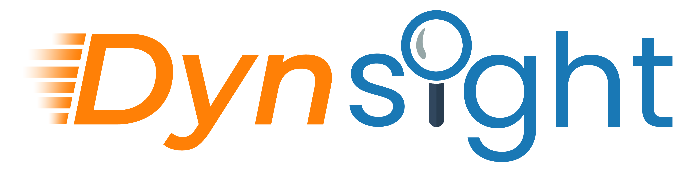

.. |pymin| image:: https://img.shields.io/badge/Python-%3E%3D3.8-blue
   :target: https://www.python.org/downloads/
.. |pytested| image:: https://img.shields.io/badge/Tested_on-3.10%20|%203.13-blue
   :target: https://www.python.org/downloads/
.. |doi| image:: https://img.shields.io/badge/Cite-J.%20Chem.%20Phys.%282026%29-red
   :target: https://doi.org/10.1063/5.0309974

|pymin| |pytested| |doi|

  
Overview
========

``dynsight`` is an open Python platform built to support a wide range of tasks commonly encountered 
in the analysis of complex dynamical systems. The software contains and combines modules that allows
resolving and handling trajectory data, computing single-particle descriptors obtaining time-series
data that are easier to analyze, performing time-series data clustering, and extracting relevant information out of them. 
``dynsight`` contains also various auxiliary tools useful to data analysis, including, e.g., modules 
(`vision <https://dynsight.readthedocs.io/en/latest/vision.html>`_ and `track <https://dynsight.readthedocs.io/en/latest/track.html>`_)  
for resolving individual-object trajectories for many-body systems - e.g., experimental ones - for which these are 
not readily available, denoising algorithms, and tools for assessing maximum information extraction from data. 
 
The documentation is available at: `dynsight.readthedocs.io <https://dynsight.readthedocs.io>`_
 
If you use ``dynsight``, please to cite the associated scientific paper:
 
| S. Martino, M. Becchi, A. Tarzia, D. Rapetti, C. Lionello & G. M. Pavan
| "dynsight: an open Python platform for simulation and experimental trajectory data analysis"  
| J. Chem. Phys. (2026), DOI: `10.1063/5.0309974 <https://doi.org/10.1063/5.0309974>`_

Installation
============

To get ``dynsight``, you can install it with pip::

    $ pip install dynsight

Optional Dependancies
---------------------

Old versions ``dynsight`` used ``cpctools`` for SOAP calculations, if
you are using Python 3.10 and below, you can use ``cpctools`` to access
``SOAPify`` and ``hd5er`` using ::

  $ pip install cpctools

If you want to use the ``dynsight.vision`` and ``dynsight.track`` modules
you will need to install a series of packages. This can be done with with pip::

  $ pip install ultralytics PyYAML

How to get started
------------------

We suggest you give a read to the ``dynsight.trajectory`` module documentation,
which offers a compact and easy way of using most of the ``dynsight`` tools. 
Also, the documentation offers some copiable Recipes and Examples for the most
common analyses.

How to contribute
-----------------

If you make changes or improvements to the codebase, please open a pull request
on our GitHub repository. This allows us to review, discuss, and integrate
contributions in a transparent and collaborative manner. Make sure to include
a clear description of the changes and link any related issues if applicable.

Developer Setup
---------------

#. Install `just`_.
#. In a new virtual environment run::

    $ just dev

#. Run code checks::

    $ just check

.. _`just`: https://github.com/casey/just

Tutorials and examples
======================

We provide and continuously update a set of tutorials to help new users to
get started with ``dynsight``. They are available at the following link: 
https://dynsight.readthedocs.io/en/latest/tutorials_menu.html.

There are also examples throughout the documentation and available in
the ``examples/`` directory of this repository.

Related works and packages
==========================

``dynsight`` uses many different open-source packages. Please cite them when appropriate:

* Most modules also use MDAnalysis, https://www.mdanalysis.org/pages/citations/
* If you use SOAP, please cite https://doi.org/10.1103/PhysRevB.87.184115 and DScribe https://singroup.github.io/dscribe/latest/citing.html
* If you use timeSOAP, please cite https://doi.org/10.1063/5.0147025
* If you use LENS, please cite: https://doi.org/10.1073/pnas.2300565120
* If you use onion-clustering, please cite: https://doi.org/10.1073/pnas.2403771121
* If you use tICA, please cite ``deeptime`` https://deeptime-ml.github.io/latest/index.html
* If you use ``dynsight.vision``, please cite Ultralytics YOLO https://docs.ultralytics.com/it/models/yolo11/#usage-examples
* If you use ``dynsight.track``, please cite Trackpy https://soft-matter.github.io/trackpy/dev/introduction.html
* Entropy calculations are based on ``infomeasure`` https://doi.org/10.1038/s41598-025-14053-5

Acknowledgements
================

``dynsight`` is developed and mantained by the G. M. Pavan group at Politecnico di Torino, https://www.gmpavanlab.polito.it/.
Many group members continuously provide, with their daily work, useful feedback that we gratefully acknowledge.
