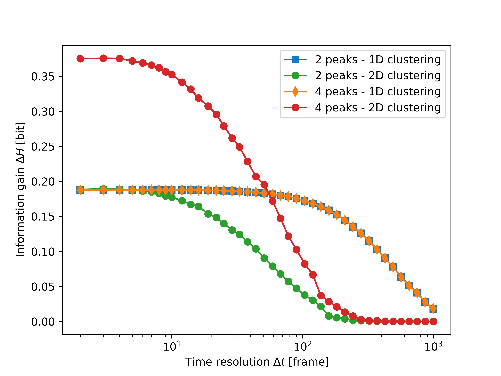

Information gain computation
============================

For the theoretical aspects of this work, see see https://doi.org/10.48550/arXiv.2504.12990.

Here we show how to compute the information gain through clustering. To this end, we create two datasets by simulating the Langevin Dynamics of particles moving in two different bidimensional potential energy landscapes, one with two and one with four minima. We compare the information gain after clustering the particles' trajectories, using either one or both variables. 

To start, let's import the packages we will need and create a folder in the cwd to save the results in.

.. code-block:: python

    from pathlib import Path
    from typing import Callable
    import numpy as np
    import matplotlib.pyplot as plt

    cwd = Path.cwd()
    folder_name = "info_gain"
    folder_path = cwd / folder_name
    if not folder_path.exists():
        folder_path.mkdir()

Now, we want to simulate the Langevin Dynamics. We start defining the potential energy landscapes, with two and four minima. 

.. code-block:: python

    def energy_landscape_1(x: float, y: float) -> float:
        """A potential energy landscape with 2 minima."""
        sigma = 0.12  # Width of the Gaussian wells
        gauss1 = np.exp(-(x**2 + y**2) / (2 * sigma**2))
        gauss2 = np.exp(-(x**2 + (y - 1) ** 2) / (2 * sigma**2))
        return -np.log(gauss1 + gauss2 + 1e-6)

    def energy_landscape_2(x: float, y: float) -> float:
        """A potential energy landscape with 4 minima."""
        sigma = 0.12  # Width of the Gaussian wells
        gauss1 = np.exp(-(x**2 + y**2) / (2 * sigma**2))
        gauss2 = np.exp(-((x - 1) ** 2 + y**2) / (2 * sigma**2))
        gauss3 = np.exp(-(x**2 + (y - 1) ** 2) / (2 * sigma**2))
        gauss4 = np.exp(-((x - 1) ** 2 + (y - 1) ** 2) / (2 * sigma**2))
        return -np.log(gauss1 + gauss2 + gauss3 + gauss4 + 1e-6)

To compute the force acting on the particle, we need to compute the potential energy gradient. 

.. code-block:: python

    def numerical_gradient(
        f: Callable[[float, float], float], x: float, y: float, h: float = 1e-5
    ) -> tuple[float, float]:
        """Compute numerical gradient using finite differences."""
        grad_x = (f(x + h, y) - f(x - h, y)) / (2 * h)
        grad_y = (f(x, y + h) - f(x, y - h)) / (2 * h)
        return -grad_x, -grad_y

This function simulates, for both energy landscapes, the dynamics of 100 particles for 10000 timesteps. Particles are initialized close to the minima. 

.. code-block:: python

    def create_trajectory(
        energy_landscape: Callable[[float, float], float], file_name: Path
    ) -> np.ndarray:
        """Simulate Langevin Dynamics on a given energy landscape."""
        rng = np.random.default_rng(0)
        n_atoms = 100
        time_steps = 10000
        dt = 0.01  # Time step
        diffusion_coeff = 0.6  # Diffusion coefficient (random noise strength)

        if energy_landscape == energy_landscape_1:
            particles = rng.standard_normal((n_atoms, 2)) * 0.2
            particles[n_atoms // 2 :, 1] += 1.0
        else:
            particles = rng.standard_normal((n_atoms, 2)) * 0.2
            n_group = n_atoms // 4
            particles[n_group : 2 * n_group, 1] += 1  # (0, 1)
            particles[2 * n_group : 3 * n_group, 0] += 1  # (1, 0)
            particles[3 * n_group :, 0] += 1  # (1, 1)
            particles[3 * n_group :, 1] += 1

        trajectory = np.zeros((time_steps, n_atoms, 2))
        for t in range(time_steps):
            for i in range(n_atoms):
                x, y = particles[i]
                fx, fy = numerical_gradient(energy_landscape, x, y)
                noise_x = np.sqrt(2 * diffusion_coeff * dt) * rng.standard_normal()
                noise_y = np.sqrt(2 * diffusion_coeff * dt) * rng.standard_normal()

                # Update position with deterministic force and stochastic term
                particles[i, 0] += fx * dt + noise_x
                particles[i, 1] += fy * dt + noise_y

                trajectory[t, i] = particles[i]

        plt.figure()
        plt.plot(trajectory[:, :, 0], trajectory[:, :, 1])
        plt.show()

        dataset = np.transpose(trajectory, (1, 0, 2))
        np.save(filename, dataset)
        return dataset

Let's simulate the trajectories and store them in two variables. We also save them as .npy files so that we don't have to simulate them every time. 

.. code-block:: python

    file_1 = folder_path / "trj_2.npy"  #  With 2 minima
    file_2 = folder_path / "trj_4.npy"  #  With 4 minima

    if not file_1.exists():
        dataset_1 = create_trajectory(energy_landscape_1, file_1)

    dataset_1 = np.load(file_1)

    if not file_2.exists():
        dataset_2 = create_trajectory(energy_landscape_2, file_2)

    dataset_2 = np.load(file_2)

Now that we have the trajectories, we can, for each one, perform Onion clustering and computing the corresponding information gain, using either 

- only the y coordinate, or
- both x and y coordinates

For each case, we do the analysis for a range of values of the Onion clustering time resolution ∆t. The information gain for each analysis is saved in the variable "results". 
To check if the clustering is working in a meaningful way, we also plot the results of Onion clustering for one specific value of ∆t. 

.. code-block:: python

    delta_t_list = np.unique(np.geomspace(2, 1000, 45, dtype=int))
    results = np.zeros((4, delta_t_list.size))
    example_delta_t = 4  #  Choosing a ∆t which works well to plot results

    for i, dataset in enumerate([dataset_1, dataset_2]):
        n_atoms, n_frames, n_dims = dataset.shape

        # We can do clustering using only the y variable:
        y_positions = dataset[:, :, 1]
        info_gain_y = np.zeros(delta_t_list.size)

        for j, delta_t in enumerate(delta_t_list):
            reshaped_data = dynsight.onion.helpers.reshape_from_nt(
                y_positions, delta_t
            )
            state_list, labels = dynsight.onion.onion_uni(reshaped_data)

            if j == example_delta_t:
                dynsight.onion.plot.plot_output_uni(
                    f"Example_{i}_1D.png",
                    reshaped_data,
                    n_atoms,
                    state_list,
                )

            # and compute the information gain:
            info_gain_y[j], *_ = dynsight.analysis.compute_entropy_gain(
                reshaped_data, labels, n_bins=40
            )
        results.append(info_gain_y)

        # Or we can do clustering using both (x, y) variables:
        info_gain_xy = np.zeros(delta_t_list.size)
        tmp1_dataset = np.transpose(dataset, (2, 0, 1))
        for j, delta_t in enumerate(delta_t_list):
            reshaped_data = dynsight.onion.helpers.reshape_from_dnt(
                tmp1_dataset, delta_t
            )
            state_list, labels = dynsight.onion.onion_multi(reshaped_data)

            if j == example_delta_t:
                dynsight.onion.plot.plot_output_multi(
                    f"Example_{i}_2D.png",
                    tmp1_dataset,
                    state_list,
                    labels,
                    delta_t,
                )

            # and compute the information gain:
            # We need an array (n_samples, n_dims), and labels (n_samples,)
            n_sequences = int(n_frames / delta_t)
            long_labels = np.repeat(labels, delta_t)
            tmp = dataset[:, : n_sequences * delta_t, :]
            ds_reshaped = tmp.reshape((-1, n_dims))

            info_gain_xy[j], *_ = dynsight.analysis.compute_entropy_gain_multi(
                ds_reshaped, long_labels, n_bins=[40, 40]
            )
        # Need to multiply by two because it's 2 dimensional, and the output
        # of the info_gain functions is normalized by the log volume of the
        # phase space, which is 2D is doubled
        info_gain_xy *= 2
        results.append(info_gain_xy)

Here are the plots of the two datasets, with the different clusters identified when clustering the full, bi-dimensional data, using ∆t = 4 frames:

.. list-table::
   :widths: auto
   :align: center

   * - .. image:: _static/info_gain_clusters_1d.png
     - .. image:: _static/info_gain_clusters_2d.png

As can be seen, all the clusters are correctly identified at this time resolution ∆t. When we are using only the y-coordinate instead, as expected in both cases just two clusters can be identified (the two plots look the same but they are actually from the two different systems):

.. list-table::
   :widths: auto
   :align: center

   * - .. image:: _static/info_gain_clusters_1d_y.png
     - .. image:: _static/info_gain_clusters_2d_y.png

We can now plot, for every case and for every choice of ∆t, the corresponding information gain. 

.. code-block:: python

    colorlist = ["C0", "C2", "C1", "C3"]
    markerlist = ["s", "o", "d", "o"]
    labellist = [
        "2 peaks - 1D clustering",
        "2 peaks - 2D clustering",
        "4 peaks - 1D clustering",
        "4 peaks - 2D clustering",
    ]

    fig, ax = plt.subplots()
    for i, system in enumerate(results):
        ax.plot(
            delta_t_list,
            system,
            label=labellist[i],
            c=colorlist[i],
            marker=markerlist[i],
        )

    ax.set_xlabel(r"Time resolution $\Delta t$ [frame]")
    ax.set_ylabel(r"Information gain $\Delta H$ [bit]")
    ax.set_xscale("log")
    ax.legend()
    plt.show()

As can be seen in the plot below, clustering both datasets using only the y coordinate gives the same information gain, because only two clusters can be distinguished. 

Clustering the trajectories in the energy potential with two minima using both variables gives once again the same information gain for small values of ∆t; then, the clustering performance degrades because the fraction of classifiable data points starts to decreases. 

Finally, clustering the trajectories in the energy potential with four minima using both variables gives an information gain which is double the previous ones (at least for small ∆t), which makes sense, because 4 clusters are discovered instead of 2. For larger ∆t, we see the same degrading in performance that always affects clustering on multivariate distributions. 

