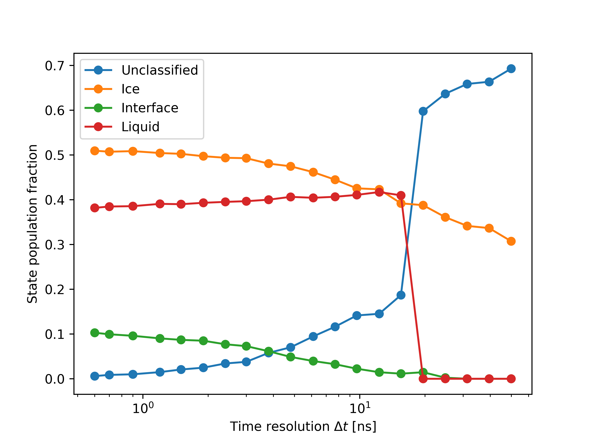
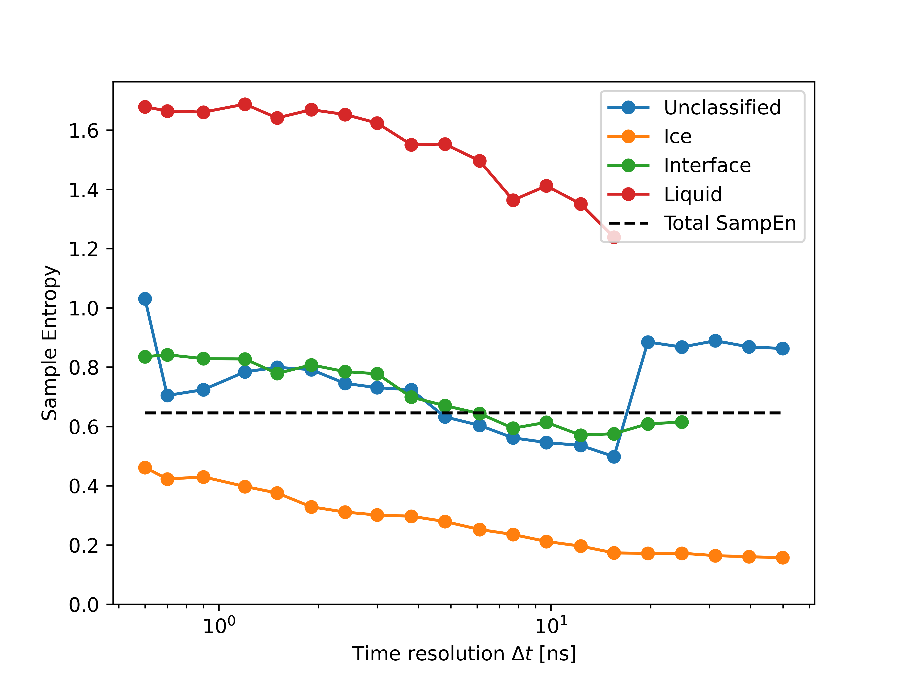
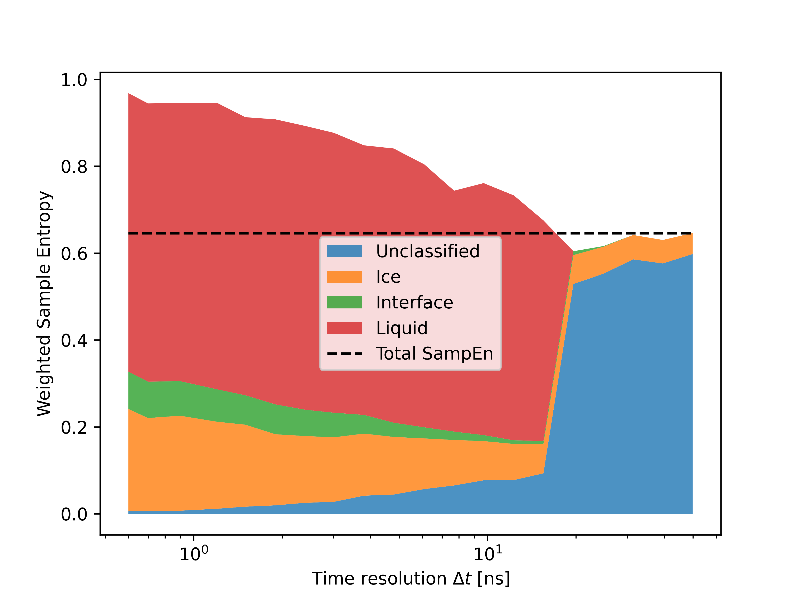

Sample Entropy computation
==========================

Here we show how to compute the Sample Entropy (SampEn) of a dataset of time-series, comparing the SampEn of the entire dataset with the one of the clusters identified by Onion Clustering. 

To start, let's import the packages we will need and create a folder in the current working directory to save the results in.

.. code-block:: python

    from pathlib import Path
    import matplotlib.pyplot as plt
    import numpy as np
    import dynsight

    cwd = Path.cwd()
    folder_name = "samp_en"
    folder_path = cwd / folder_name
    if not folder_path.exists():
        folder_path.mkdir()

As data, we use LENS signals from a water/ice coexistence simulation which can be downloaded using 

.. code-block:: bash

    git clone git@github.com:matteobecchi/onion_example_files.git

Let's load the dataset; SampEn calculation is quite time-consuming, so we can use the data from one in every ten molecules. Also, the first frame of the LENS array is always 0.0, so we ignore that value. The sampling time of the time-series is 0.1 ns. 

.. code-block:: python

    data_directory = "onion_example_files/data/univariate_time-series.npy"
    data = np.load(data_directory)[::10, 1:]
    t_samp = 0.1

The main goal of this example is to compute the combined SampEn of a collection of time-series. We do that by defining the following function, which computes the SampEn of each time-series and then takes the average, ignoring the cases where the result is NaN: 

.. code-block:: python

    def combined_sample_entropies(
        data: np.ndarray | list[np.ndarray],
        r_factor: float | np.float64,
        m_par: int = 2,
    ) -> float:
        """Compute the average sample entropy of a time-series dataset.

        The average is computed ignoring possible NaN values.

        Parameters:
            data : np.ndarray of shape (n_particles, n_frames) or list of np.ndarray of shape (n_frames,).

            r_factor : float
                The similarity threshold between signal windows. A common choice
                is 0.2 * the standard deviation of the dataset.

            m_par : int (default 2)
                The m parameter (length of the considered overlapping windows).

        Returns:
            float: The sample entropy of the dataset (average over all the particles, ignoring NaN).
        """
        if isinstance(data, np.ndarray) and data.ndim == 1:
            data = [data]

        sampen = []
        for particle in data:
            try:
                tmp = dynsight.analysis.sample_entropy(particle, r_factor, m_par)
                sampen.append(tmp)
            except RuntimeError:
                continue

        return np.mean(np.array(sampen))

Now, we can compute the SampEn for the entire dataset. We have to set the distance threshold r_factor, which is usually set equal to 0.2 times the standard deviation of the dataset. 

.. code-block:: python

    r_fact = 0.2 * np.std(data)
    aver_samp_en = combined_sample_entropies(data, r_factor=r_fact)

Then we can perform Onion Clustering at different ∆t and compute the sample entropy of the different clusters. We want to store both the absolute value of the sampe entropy and the fraction of data-points in each cluster, so that we can then compute the weighted SampEn by multiplying the two quantities. 

For the computation of the SampEn of a cluster, we need a function that creates a list of all the time-series assigned to that cluster. 

.. code-block:: python

    def extract_sequences_for_label(
        data: NDArray[np.float64],
        reshaped_data: NDArray[np.float64],
        labels: NDArray[np.int64],
        delta_t: int,
        target_label: int,
    ) -> list[NDArray[np.float64]]:
        """Creates the list of sequences clustered in a specific cluster.

        Extracts sequences corresponding to a specific label from the original
        data, merging only consecutive windows with the same label.

        Parameters:
            data (np.ndarray):
                Original data of shape (n_atoms, n_frames).

            reshaped_data (np.ndarray):
                Windowed data of shape (n_atoms * n_windows, delta_t).

            labels (np.ndarray):
                Cluster labels of shape (n_atoms * n_windows,).

            delta_t (int):
                The length of each time window.

            target_label (int):
                The label for which sequences should be extracted.

        Returns:
            list: A list of sequences (np.ndarray) where each entry is a
            concatenated segment from `data` corresponding to consecutive
            occurrences of `target_label`.
        """
        n_atoms, n_frames = data.shape
        sequences = []  # List to store sequences for the target label

        # Reshape labels to match (n_atoms, n_windows)
        n_windows = n_frames // delta_t
        labels = labels.reshape((n_atoms, n_windows))

        for atom_idx in range(n_atoms):  # Iterate over each particle
            current_sequence: list[NDArray[np.float64]] = []

            for window_idx in range(n_windows):
                if labels[atom_idx, window_idx] == target_label:
                    # Add the current window to the sequence
                    current_sequence.extend(
                        reshaped_data[atom_idx * n_windows + window_idx, :]
                    )
                # If we had an active sequence, store it and reset
                elif current_sequence:
                    sequences.append(np.array(current_sequence))
                    current_sequence = []

            # Append the last sequence if it was still active
            if current_sequence:
                sequences.append(np.array(current_sequence))

        return sequences

With this function, we are ready to perform Onion at different ∆t. 

.. code-block:: python

    delta_t_list = np.unique(np.geomspace(6, 499, 20, dtype=int))

    samp_en_list = []
    fractions = []
    for _, delta_t in enumerate(delta_t_list):
        reshaped_data = dynsight.onion.helpers.reshape_from_nt(
            data, delta_t
        )
        state_list, labels = dynsight.onion.onion_uni(reshaped_data)

        tmp_list = []
        tmp_frac = []
        for label in np.unique(labels):
            selected_data = extract_sequences_for_label(
                data,
                reshaped_data,
                labels,
                delta_t,
                label,
            )

            tmp_sampen = combined_sample_entropies(
                selected_data, r_factor=r_fact
            )
            tmp_list.append(tmp_sampen)
            fraction = np.sum(labels == label) / labels.size
            tmp_frac.append(fraction)

        samp_en_list.append(tmp_list)
        fractions.append(tmp_frac)

We save the results in a np.array, which makes it easier to work with them later.

.. code-block:: python

    max_n_states = np.max([len(tmp) for tmp in samp_en_list])
    for i, tmp in enumerate(samp_en_list):
        while len(tmp) < max_n_states:
            tmp.append(0.0)
            fractions[i].append(0.0)

    samp_en_array = np.array(samp_en_list).T
    frac_array = np.array(fractions).T

Finally, we can plot the results. First of all, we can plot the fraction of data-points classified in each cluster as a function of ∆t:

.. code-block:: python

    labels = ["Unclassified", "Ice", "Interface", "Liquid", "Total SampEn"]

    fig, ax = plt.subplots()
    for i, state in enumerate(samp_en_array):
        mask = state != 0.0
        ax.plot(
            delta_t_list * t_samp,
            frac_array[i],
            label=labels[i],
            marker="o",
        )
    ax.set_xlabel(r"Time resolution $\Delta t$ [ns]")
    ax.set_ylabel("State population fraction")
    ax.set_xscale("log")
    ax.legend()
    fig.savefig(folder_path / "Fig1.png", dpi=600)

Which gives us the folowing output:

Then, we can plot the SamEn of each individual cluster:

.. code-block:: python

    fig, ax = plt.subplots()
    for i, state in enumerate(samp_en_array):
        mask = state != 0.0
        ax.plot(
            delta_t_list[mask] * t_samp,
            state[mask],
            label=labels[i],
            marker="o",
        )
    ax.plot(
        delta_t_list * t_samp,
        aver_samp_en * np.ones(len(delta_t_list)),
        label=labels[-1],
        ls="--",
        c="k",
    )
    ax.set_xlabel(r"Time resolution $\Delta t$ [ns]")
    ax.set_ylabel("Sample Entropy")
    ax.set_xscale("log")
    ax.set_ylim(bottom=0.0)
    ax.legend()
    fig.savefig(folder_path / "Fig1.png", dpi=600)

As expected, solid ice has a very low SampEn, liquid water has the highest, and the interface has intermediate values. Moreover, the SampEn decreases as ∆t increases, because a larger ∆t enforces clusters with stronger temporal coherence. 

Finally, we can plot the SampEn weighted with the population fraction of each cluster. Differently from Shannon entropy, there is no guarantee that SampEn is convex, and thus values larger than the SampEn of the entire dataset are possible.

.. code-block:: python

    fig, ax = plt.subplots()
    y_val = np.zeros(samp_en_array.shape[1])
    for i, state in enumerate(samp_en_array):
        ax.fill_between(
            delta_t_list * 0.1,
            y_val,
            y_val + state * frac_array[i],
            label=labels[i],
            alpha=0.8,
        )
        y_val += state * frac_array[i]
    ax.plot(
        delta_t_list * 0.1,
        aver_samp_en * np.ones(len(delta_t_list)),
        label=labels[-1],
        ls="--",
        c="k",
    )
    ax.set_xlabel(r"Time resolution $\Delta t$ [ns]")
    ax.set_ylabel("Weighted Sample Entropy")
    ax.set_xscale("log")
    ax.legend()
    fig.savefig(folder_path / "Fig3.png", dpi=600)

