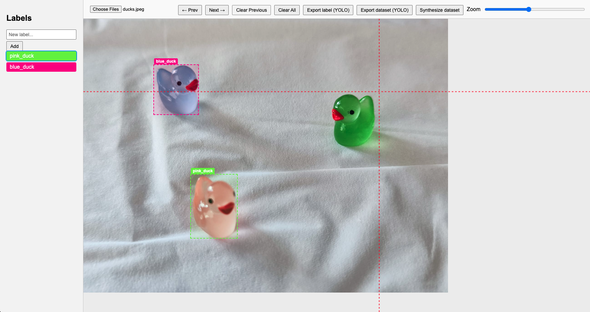
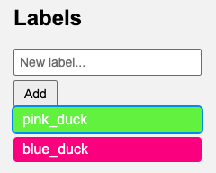
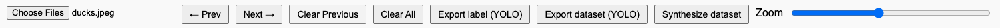

The Label Tool
==============

The ``dynsight label_tool`` is a simple web application that allows users to
label images. Picture labelling is a crucial step in many computer vision tasks,
such as the creation of initial training dataset to train Convolutional Neural
Networks (CNNs) model. The current version of `dynsight vision <../_autosummary/dynsight.vision.VisionInstance.html>`_
exploits the power of the `YOLO models <https://docs.ultralytics.com/models/yolo12/>`_
for computer vision tasks. Thus, the ``label_tool`` has been specifically
designed to work with the YOLO dataset format.

----------
How to Use
----------

The ``label_tool`` application can be executed in 2 main ways:

* As a standalone application, run the following command in the environment
  where dynsight is installed:

.. code-block:: bash

    $ label_tool

* From python code:

.. code-block:: python

    import dynsight

    dynsight.vision.label_tool(port=8888) #port selection is optional

In both cases a localhost server should start and the application should
automatically appear in your default web browser.

.. tip::

    In case the application does
    not open automatically, you can manually open it by copying and pasting
    the URL provided in the terminal output.

-------
The GUI
-------

The ``label_tool`` Graphical User Interface is divided in three main panels:

* **The image panel**: where loaded images appear and labels can be drawn.

* **The label menu panel**: where labels can be created and edited.

* **The commands panel**: where all the available commands can be executed.

Using the ``Choose File`` button, users can select the image(s) they want to
label. Once the image is loaded, users can start drawing labels by clicking and
dragging on the image panel. The label menu panel allows users to create and
edit labels. Finally, the commands panel provides a set of exporting options:

* **Export label**: Download a single ``.txt`` file in YOLO format containing the labels for the current image.

* **Export dataset**: Download a YOLO dataset from the loaded images with the labels and create the initial yaml configuration file to be used in the YOLO training process.

* **Synthesize dataset**: Create a synthetic dataset from the drawn labels randomizing the object position in different images (useful when a low number of images is available).
