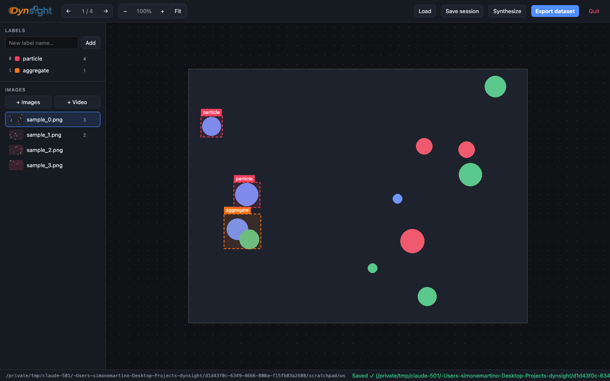

The Label Tool
==============

The ``dynsight label_tool`` is a local web application for labeling images
and building training datasets. Picture labelling is a crucial step in many
computer vision tasks, such as the creation of the initial dataset used to
train Convolutional Neural Networks (CNNs). The current version of
`dynsight vision <../_autosummary/dynsight.vision.VisionInstance.html>`_
exploits the power of the `YOLO models <https://docs.ultralytics.com/models/yolo12/>`_
for computer vision tasks. Thus, the ``label_tool`` writes datasets directly
in the YOLO format expected by
`set_training_dataset <../_autosummary/dynsight.vision.VisionInstance.html#dynsight.vision.VisionInstance.set_training_dataset>`_,
so they can be used for training without any manual editing.

----------
How to Use
----------

The ``label_tool`` application can be executed in 2 main ways:

* As a standalone application, run the following command in the environment
  where dynsight is installed:

.. code-block:: bash

    $ label_tool

* From python code:

.. code-block:: python

    import dynsight

    dynsight.vision.label_tool(
        port=8888,  # optional
        workspace="my_workspace",  # optional
    )

In both cases a localhost server should start and the application should
automatically appear in your default web browser.

.. tip::

    In case the application does
    not open automatically, you can manually open it by copying and pasting
    the URL provided in the terminal output.

All uploaded images are stored inside the *workspace* directory
(``./label_tool_workspace`` by default). The labeling session (labels and
boxes) is kept in memory and is **never written to disk automatically**:
use the *Save session* button to write it to a JSON file at a path of your
choice, and *Load* to restore it later. If the session has unsaved changes,
the *Quit* button asks whether to save it before stopping the server
(``Ctrl+C`` in the terminal also stops it).

-------
The GUI
-------

The Graphical User Interface is divided in three main panels:

* **The labels panel** (top left): create the object classes. Each label
  shows its YOLO class ID, its color and the number of boxes drawn with it.
  Class IDs follow the order of this list and are stable across exports.

* **The images panel** (bottom left): add content with ``+ Images`` or
  ``+ Video`` (frames are extracted at a chosen interval), or by dragging
  and dropping files onto the canvas. Each entry shows a thumbnail and its
  number of annotations.

* **The canvas** (right): displays the current image and the bounding
  boxes.

Annotating is done directly on the canvas:

* **Draw**: select a label, then click and drag.
* **Select**: click a box.
* **Move / resize**: drag a selected box, or drag one of its handles.
* **Change label**: select a box, then click a different label.
* **Delete**: right-click a box, or select it and press backspace.
* **Navigate**: mouse wheel to zoom, space (or middle mouse) drag to pan,
  arrow keys to switch image.

Every long operation (image and video uploads, frame extraction, dataset
export and synthesis) shows a progress bar at the bottom of the canvas.

Two export options are available in the top bar. Both write the dataset
folder directly to disk (inside the workspace by default) together with a
ready-to-use ``dataset.yaml``:

* **Export dataset**: exports the loaded images and their labels as a YOLO
  dataset, with a configurable (and optionally shuffled) train/validation
  split.

* **Synthesize**: creates a synthetic dataset by pasting the annotated
  crops at random, non-overlapping positions onto uniform backgrounds
  (useful when only a few labeled images are available).
