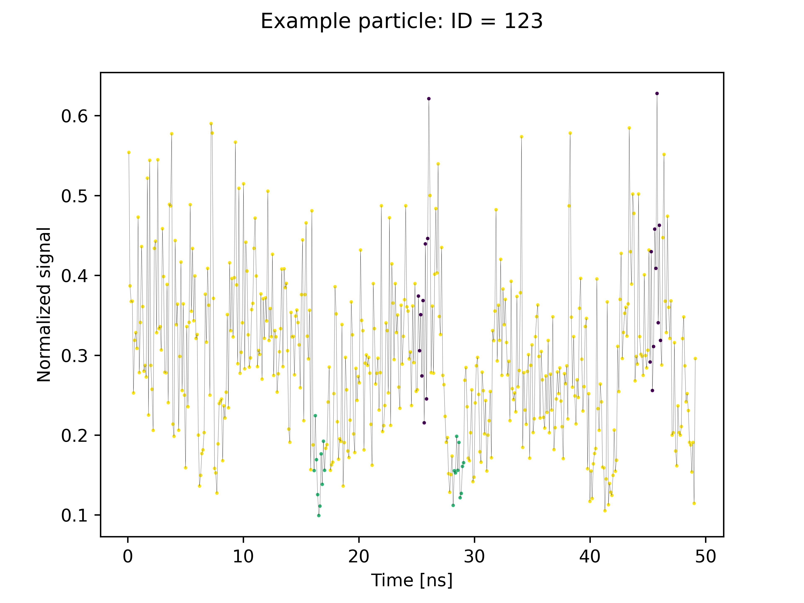

Onion clustering
================

Code for unsupervised clustering of time-correlated data. 

Dynsight acts as an interface to the clustering code found at this github https://github.com/matteobecchi/timeseries_analysis and described in this paper (link with DOI, when available). 

---------------------------------------------
Example: clustering of univariate time-series
---------------------------------------------

.. toctree::
  :maxdepth: 1

  OnionUni <_autosummary/dynsight.onion.OnionUni.rst>

The code for performing clustering on univariate time-series can be found in ``examples/onion_uni.py``. 

Input
-----

Inside the code, you have to set the parameters of your analysis:

* ``tau_window`` (``int``): the length of the time window (in number of frames).
* ``t_smooth=1`` (``int``, optional): the length of the smoothing window (in number of frames) for the moving average. A value of t_smooth = 1 correspond to no smoothing. 
* ``t_delay=0`` (``int``, optional): is for ignoring the first tau_delay frames of the trajectory. 
* ``t_conv=1`` (``int``, optional): converts number of frames in time units. 
* ``time_units='frames'`` (``str``, optional): a string indicating the time units. 
* ``example_ID=0`` (``int``, optional): plots the trajectory of the molecule with this ID, colored according to the identified states. 
* ``bins`` (``int``, optional): the number of bins used to compute histograms. This should be used only if all the fits fail with the automatic binning.
* ``num_tau_w=20`` (``int``, optional): the number of different tau_window values tested. 
* ``min_tau_w=2`` (``int``, optional): the smaller tau_window value tested. It has to be larger that 1. 
* ``max_tau_w`` (``int``, optional): the larger tau_window value tested. It has to be larger that 2. Default is the largest possible window.
* ``min_t_smooth=1`` (``int``, optional): the smaller t_smooth value tested. It has to be larger that 0. 
* ``max_t_smooth=5`` (``int``, optional): the larger t_smooth value tested. It has to be larger that 0. 
* ``step_t_smooth=1`` (``int``, optional): the step in the t_smooth values tested. It has to be larger that 0. 

Then the code is run using ``python3 onion_uni.py path/to/input/file.npy`` where ``path/to/input/file.npy`` is the path to your input data. 

The input data have to be a one-dimensional timeseries, computed on `N` particles for `T` frames. The input files must contain an array with shape `(N, T)` Supported formats: .npy, .npz, .txt. Also .xyz trajectories are supported. 

Output
------

The algorithm will attempt to perform the clustering on the input data, using different ``t_smooth`` (from 1 frame, i.e no smoothing, to 5 frames, unless differently specified in the input parameters) and different ``tau_window`` (logarithmically spaced between 2 frames and the entire trajectory length, unless differently specified in the input parameters).

* The file ``number_of_states.txt`` contains the number of clusters for each combination of ``tau_window`` and ``t_smooth`` tested.
* The file ``fraction_0.txt`` contains the fraction of unclassified data points for each combination of ``tau_window`` and ``t_smooth`` tested.
* The figure ``output_figures/Time_resolution_analysis.png`` plots the previous two data:

.. image:: _static/onion/Time_resolution_analysis_1.png
   :width: 600
   :align: center

* Figures with all the Gaussian fittings are saved in the folder ``output_figures`` with the format ``t_smooth_tau_window_Fig1_iteration.png``.

Then, the analysis with the values of ``tau_window`` and ``t_smooth`` specified in ``input_parameters.txt`` will be performed.

* The file ``states_output.txt`` contains information about the recursive fitting procedure, useful for debugging.
* The file ``final_states.txt`` contains the list of the states, for which central value, width and relevance are listed.
* The file ``final_tresholds.txt`` contains the list of the tresholds between states.
* ``output_figures/Fig0.png`` plots the raw data:

.. image:: _static/onion/Fig0.png
   :width: 600
   :align: center

* ``output_figures/Fig1_iteration.png`` plot the histograms and best fits for each iteration, for instance

.. image:: _static/onion/Fig1_1.png
   :width: 600
   :align: center

* ``output_figures/Fig2.png`` plots the data with the clustering thresholds and Gaussians:

.. image:: _static/onion/Fig2.png
   :width: 600
   :align: center

* ``output_figures/Fig3.png`` plots the colored signal for the particle with ``example_ID`` ID:

* ``output_figures/Fig4.png`` shows the mean sequence inside each state, and it's useful for checking the meaningfulness of the results.

.. image:: _static/onion/Fig4.png
   :width: 600
   :align: center

* If the trajectory from which the signal was computed is present in the working directory, and called ``trajectory.xyz``, a new file, ``colored_trj.xyz`` will be printed, with the correct typing according to the clustering. 
* Otherwise, the file ``all_cluster_IDs_xyz.dat`` allows to plot the trajectory using the clustering for the color coding. Altough, it is not super friendly to use. 

The example code provides also the methods to extract the output in the python script, instead of having to read it from the output files. 

-----------------------------------------------
Example: clustering of multivariate time-series
-----------------------------------------------

.. toctree::
  :maxdepth: 1

  OnionMulti <_autosummary/dynsight.onion.OnionMulti.rst>

The code for performing clustering on multi time-series can be found in ``examples/onion_multi.py``. The only difference in the usage is that when you run the script you have to specify all the input files, each one containing a different variable:

``python3 onion_multi.py path/to/input/file_0.npy path/to/input/file_1.npy``
