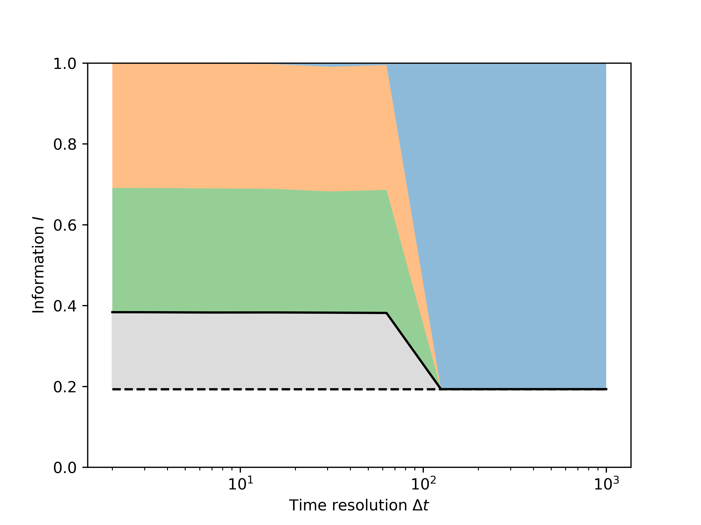

Information gain analysis
=========================

For the theoretical aspects of this work, see https://doi.org/10.48550/arXiv.2504.12990.

This recipe explains how to compute the information gain through clustering
analysis. We use a synthetic dataset containing a signal that oscillates
between 0 and 10, with Gaussian noise. Onion clustering is run on a broad
range of time resolutions ∆t. The information gain and the Shannon entropy of
the environments is computed for each value of ∆t. The analysis is implemented
using onion 2.0.0 ("onion smooth").

First of all, we import all the packages and objects we'll need:

.. testcode:: recipe3-test

    from pathlib import Path

    import numpy as np
    import dynsight
    import matplotlib.pyplot as plt

Let's start by creating a the synthetic dataset:

.. testcode:: recipe3-test

    rng = np.random.default_rng(1234)

    # Parameters
    n_atoms = 10
    num_blocks = 10
    block_size = 100
    sigma = 1.0

    # Generate the array
    tmp_data = [
        np.concatenate(
            [
                rng.normal(loc=10 * (i % 2), scale=sigma, size=block_size)
                for i in range(num_blocks)
            ]
        )
        for _ in range(n_atoms)
    ]
    data = np.array(tmp_data)

The following function takes as input the dataset, and a list of values
of time resolutions ∆t, and for each of these it performs Onion clustering, and
computes the information gain achieved through clustering with that ∆t.

.. warning::

    For now, this only works with univariate datasets.

The function's output is a tuple of ``np.ndarray``, which for each value of ∆t
contain:

* the number of identified clusters - shape (delta_t_list.size,);
* the population fraction of each cluster - shape (delta_t_list.size, n_clust);
* the information gain - shape (delta_t_list.size,);
* the Shannon entropy of each cluster - shape (delta_t_list.size, n_clust).

Additionally, the (float) dataset Shannon entropy is returned.

.. testcode:: recipe3-test

    def info_gain_with_onion(
        delta_t_list: np.ndarray | list[int],
        data: np.array,
    ) -> tuple[np.ndarray, np.ndarray, np.ndarray, np.ndarray, float]:
        """Performs full information gain analysis with Onion clustering."""
        n_clusters = np.zeros(delta_t_list.size)
        clusters_frac = []
        delta_h = np.zeros(delta_t_list.size)
        clusters_entr = []

        for i, delta_t in enumerate(delta_t_list):
            state_list, labels = dynsight.onion.onion_uni_smooth(
                data,
                delta_t=delta_t,
            )

            n_clusters[i] = len(state_list)
            tmp_frac = [0.0] + [state.perc for state in state_list]
            tmp_frac[0] = 1.0 - np.sum(tmp_frac)
            clusters_frac.append(tmp_frac)

            flat_data = data.ravel()
            flat_labels = labels.ravel()
            delta_h[i], _, h_0, _ = dynsight.analysis.info_gain(
                flat_data,
                flat_labels,
                method="kl",
            )

            tmp_entr = []
            label_list = np.unique(labels)
            if label_list[0] != -1:
                tmp_entr.append(-1.0)

            for _, lab in enumerate(label_list):
                mask = labels == lab
                selected_points = data[mask]
                tmp_entr.append(
                    dynsight.analysis.shannon(selected_points, method="kl")
                )
            clusters_entr.append(tmp_entr)

        max_n_envs = np.max([len(elem) for elem in clusters_entr])
        for i, elem in enumerate(clusters_entr):
            while len(elem) < max_n_envs:
                elem.append(-1.0)
                clusters_frac[i].append(0.0)

        cl_frac = np.array(clusters_frac)
        cl_entr = np.array(clusters_entr)

        return n_clusters, cl_frac, delta_h, cl_entr, h_0

    # Example usage
    _, n_frames = data.shape
    delta_t_list = np.unique(np.geomspace(2, n_frames, 10, dtype=int))

    n_cl, cl_frac, delta_h, cl_entr, h_0 = info_gain_with_onion(
        delta_t_list,
        data,
    )

A default visualization of the results of this analysis can be obtained with
the following function. Be aware that this could require some tweaking to ensure
that clusters identified at different ∆t are matched in the way the user want
them to, expecially when different number of clusters are found for different ∆t
values.

.. testcode:: recipe3-test

    def plot_info_results(
        delta_t_list: np.ndarray | list[int],
        cl_frac: np.ndarray,
        cl_entr: np.ndarray,
        h_0: float,
        file_path: Path,
    ) -> None:
        frac = cl_frac.T
        entr = cl_entr.T
        s_list = []
        for i, st_fr in enumerate(frac):
            s_list.append(st_fr * entr[i])
        s_cumul = [s_list[0]]
        for _, tmp_s in enumerate(s_list[1:]):
            s_cumul.append(s_cumul[-1] + tmp_s)

        fig, ax = plt.subplots()

        h_0_array = np.ones(len(delta_t_list)) * h_0
        ax.plot(delta_t_list, h_0_array, ls="--", c="black", marker="")  # H_0
        ax.fill_between(
            delta_t_list,
            0.0,
            s_cumul[0],
            alpha=0.5,
        )
        for i, tmp_s in enumerate(s_cumul[1:]):
            ax.fill_between(
                delta_t_list,
                s_cumul[i],
                tmp_s,
                alpha=0.5,
            )
        ax.fill_between(
            delta_t_list,
            s_cumul[-1],
            h_0_array,
            color="gainsboro",
        )
        ax.plot(
            delta_t_list,
            s_cumul[-1],
            c="black",
            marker="",
        )  # I_clust

        ax.set_xlabel(r"Time resolution $\Delta t$")
        ax.set_ylabel(r"Entropy $H$")
        ax.set_xscale("log")

        fig.savefig(file_path, dpi=600)
        plt.close()

    # Example usage
    plot_info_results(
        delta_t_list,
        cl_frac,
        cl_entr,
        h_0,
        Path("./source/_static/info_plot.png"),
    )

The figure obtained (see below) shows, for each value of ∆t:

* The initial entropy H of the entire dataset: dashed line;
* The entropy after clustering: solid line;
* The information gained through clustering ∆I: gray area;
* The Shannon entropy of each of the discovered clusters: colored bands.

In this case, 2 states are correctly identified for ∆t < 100 (green and orange),
with an information gain of around 1 bit.
For ∆t > 100 all the data points remain unclassified (blue), and the information
gain goes to 0.

.. raw:: html

    <a class="btn-download" href="_static/recipes/info_gain.py" download>⬇️ Download Python Script</a>

.. testcode:: recipe3-test
    :hide:

    assert np.isclose(delta_h[0], 1.0141, atol=13-3)
