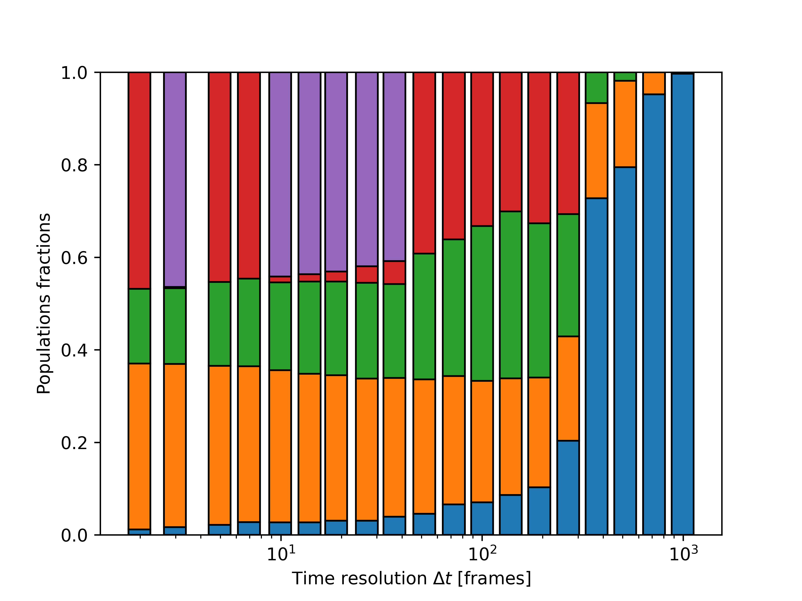

Cleaning Cluster Population
===========================

Sometimes, clusters obtained with Onion Clustering analysis can be very small.
To better interpret the results, it can be useful to remove those ones by assigning them to 
the cluster of the unclassified particles.
This is achieved through the class, :class:`.data_processing.cleaning_cluster_population()`, which 
assign the cluster under a certain population threshold to a specific cluster selected by the user. 

At the end of every section, you will find links to download the full ``python`` scripts 
and its relevant input files.

As an example, we consider the ouput of the analysis computed in the `spatial denoising tutorial <./spatial_denoising.html>`_.
Briefly, we consider the denoised ``TimeSOAP`` descriptor that can be ontained from:

.. code-block:: python

    from pathlib import Path
    from dynsight.trajectory import Trj

    files_path = Path("source/_static/simulations")
    trj = Trj.init_from_xtc(
        traj_file=files_path / "ice_water_ox.xtc",
        topo_file=files_path / "ice_water_ox.gro",
    )

    _, tsoap = trj.get_timesoap(
        r_cut=10,
        n_max=8,
        l_max=8,
        n_jobs=4, # Adjust n_jobs according to your computer capabilities
    )

    sliced_trj = trj.with_slice(slice(0, -1, 1))
    sp_denoised_tsoap = tsoap.spatial_average(
        trj=sliced_trj,
        r_cut=10,
        n_jobs=4, # Adjust n_jobs according to your computer capabilities
    )

    delta_t_list, n_clust, unclass_frac, labels = sp_denoised_tsoap.get_onion_analysis(
        delta_t_min=2,
        delta_t_num=20,
        fig1_path=files_path / "denoised_onion_analysis.png",
        fig2_path=files_path / "cluster_population.png",
    )

.. testcode:: cleaning_cluster_population_test
    :hide:
    
    from pathlib import Path
    from dynsight.trajectory import Trj

    files_path = Path("source/_static/simulations")
    trj = Trj.init_from_xtc(
        traj_file=files_path / "ice_water_ox.xtc",
        topo_file=files_path / "ice_water_ox.gro",
    )
    
    assert trj.n_atoms == 2048
    assert trj.n_frames == 1001

.. testcode:: cleaning_cluster_population_test
    :hide:

    import numpy as np

    trj_test = trj.with_slice(slice(0, 2, 1))

    expected_tests = Path("source/_static/tutorials/spatial_denoising/doctests")

    soap_test = trj_test.get_soap(
        r_cut=10, 
        n_max=8,
        l_max=8,
        n_jobs=1, # Adjust n_jobs according to your computer capabilities
    )

    _, tsoap_test = trj.get_timesoap(
        soap_insight=soap_test,
    )

    assert tsoap_test.meta["r_cut"]==10
    assert tsoap_test.meta["n_max"]==8
    assert tsoap_test.meta["l_max"]==8

    reference_tsoap = np.load(expected_tests / "test_tsoap.npy")
    assert np.allclose(tsoap_test.dataset, reference_tsoap, atol=1e-6)

    sliced_trj_test = trj.with_slice(slice(0, 1, 1))
    sp_denoised_tsoap_test = tsoap_test.spatial_average(
        trj=sliced_trj_test,
        r_cut=10,
        n_jobs=1,
    )

    reference_denoised_tsoap = np.load(expected_tests / "test_denoised_tsoap.npy")
    assert np.allclose(sp_denoised_tsoap_test.dataset, reference_denoised_tsoap, atol=1e-6)

For further details users should refers to `spatial denoising tutorial <./spatial_denoising.html>`_.

Figure `cluster_population.png` shows the population of every cluster, where blue refers to the unclassified fraction:

Before cleaning the cluster we have to save the output from the Onion analysis in an array:

.. code-block:: python

    import numpy as np

    onion_output = np.array([delta_t_list, n_clust, unclass_frac]).T

The small clusters can be removed and assigned to the unclassified fraction using the 
class :class:`.data_processing.cleaning_cluster_population()`:

.. code-block:: python

    from dynsight.data_processing import cleaning_cluster_population

    cleaned_labels = cleaning_cluster_population(labels, threshold=0.05, assigned_env=-1)

where `leaned_labels` has the same dimensions as `labels`. Now we can reproduce the plot with the number 
of clusters and the unclassified fraction after re-organizing the data:

.. code-block:: python
    
    import dynsight
    
    delta_t_list = onion_output[:, 0]  #since unchanged, windows can be copied from above
    
    n_clust = np.zeros(delta_t_list.shape[0],dtype=np.int64)
    unclass_frac = np.zeros(delta_t_list.shape[0])
    for i in range(delta_t_list.shape[0]):
        n_clust[i] = np.unique(cleaned_labels[:, :, i]).size - 1
        unclass_frac[i] = np.sum(cleaned_labels[:, :, i] == -1) / np.size(cleaned_labels[:, :, i])

    cleaned_onion_output = np.array([delta_t_list, n_clust, unclass_frac]).T

    dynsight.onion.plot_smooth.plot_time_res_analysis("cleaned_onion_analysis.png", cleaned_onion_output)

.. testcode:: cleaning_cluster_population_test
    :hide:

    from dynsight.data_processing import cleaning_cluster_population

    expected_tests = Path("../tests/data_processing/cluster/test_cluster")

    labels = np.zeros((4, 10, 3), dtype=int)

    labels[:, :, 0] = np.array(
        [
            [0, 0, 0, 1, 1, 1, 2, 2, 2, 2],
            [0, 0, 0, 1, 1, 1, 2, 2, 2, 2],
            [0, 0, 0, 1, 1, 1, 2, 2, 2, 3],
            [0, 0, 0, 1, 1, 1, 2, 2, 2, 3],
        ]
    )

    labels[:, :, 1] = np.array(
        [
            [0, 0, 0, 0, 0, 1, 1, 1, 1, 4],
            [0, 0, 0, 0, 0, 1, 1, 1, 1, 4],
            [0, 0, 0, 0, 0, 1, 1, 1, 4, 4],
            [0, 0, 0, 0, 0, 1, 1, 1, 4, 4],
        ]
    )

    labels[:, :, 2] = np.array(
        [
            [0, 0, 9, 9, 0, 1, 1, 1, 1, 9],
            [0, 0, 0, 9, 0, 1, 1, 1, 1, 9],
            [0, 0, 0, 9, 0, 1, 1, 1, 1, 9],
            [0, 9, 0, 0, 0, 1, 1, 1, 1, 9],
        ]
    )

    test_clean_pop = cleaning_cluster_population(
        labels,
        threshold=0.05,
        assigned_env=99,
    )

    exp_clean_pop = np.load(expected_tests / "c0_clean_pop_th5_ass99_exNone.npy")
    assert np.array_equal(exp_clean_pop, test_clean_pop)

On the left are reported the results from Onion clustering on the denoised time-series (`denoised_onion_analysis.png`
from `spatial denoising tutorial <./spatial_denoising.html>`_), while on the rigth is reported the figure 
`cleaned_onion_analysis.png` 

.. image:: ../_static/tutorials/spatial_denoising/denoised_onion_analysis.png
   :scale: 8%
   :align: left

.. image:: ../_static/tutorials/cleaning_cluster_population/cleaned_onion_analysis.png
   :scale: 8%
   :align: right

.. raw:: html

   

Full scripts and input files
----------------------------

.. raw:: html

    <a class="btn-download" href="../_static/simulations/ice_water_ox.gro" download>⬇️ Download the .gro file</a>  
    <a class="btn-download" href="../_static/simulations/ice_water_ox.xtc" download>⬇️ Download the .xtc file</a>  
    <a class="btn-download" href="../_static/recipes/cleaning_cluster_population.py" download>⬇️ Download Python Script</a>
