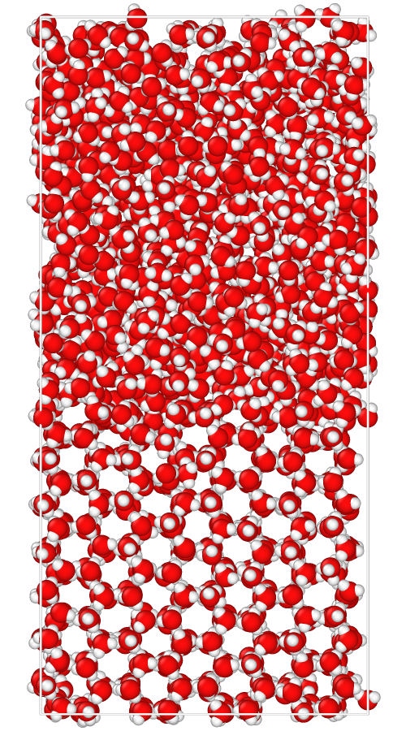
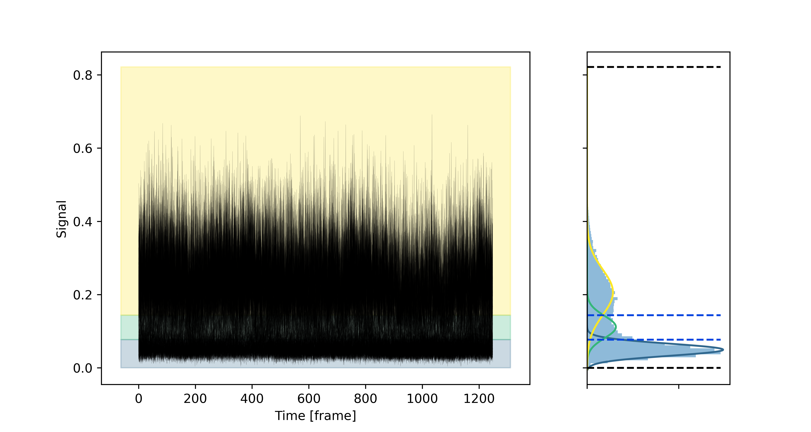
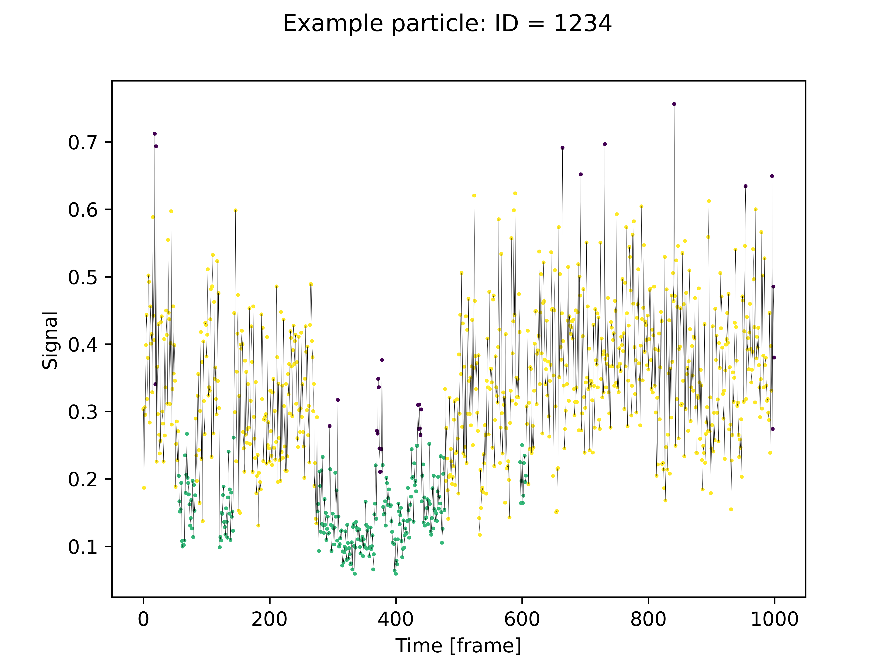
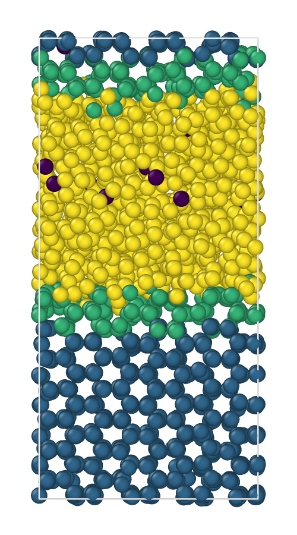

Getting Started
===============

Welcome to the first tutorial of the dynsight platform. 
Before start, we strongly suggest to read the `dynsight workflow page <../workflow.html>`_ where the typical
workflow of a typical ``dynsight`` usage is described. Briefly, the reccomended way to use ``dynsight`` is via loading a trajectory into a :class:`.trajectory.Trj`
object, and then using the methods of this class to compute the desired descriptors and/or analyses.

In this tutorial, we will show you a minimal example of a ``dynsight`` analysis workflow; 
starting from loading a trajectory, computing a descriptor and finishing
with clustering analysis. 

At the end of this tutorial, you will find links to download the full ``python`` scripts 
and its relevant input files.

1. Loading a trajectory
-----------------------

The ``dynsight.trajectory`` module provides a unified set of tools that
streamline the analysis of many-body trajectories, offering a consistent and
user-friendly interface across most analysis tasks. 

This is achieved through the class, :class:`.trajectory.Trj`, which corresponds to an
object that contains a trajectory, meaning the coordinates of a set of particles over a series of frames. 

The first step is usually to create a :class:`.trajectory.Trj` object from
some trajectory file (e.g., `.xtc` and `.gro` files for GROMACS simulation output). In this example, we are using the water/ice
coexistence trajectory, which can be downloaded here:

.. raw:: html

    <a class="btn-download" href="../../../../examples/analysis_workflow/oxygens.gro" download>⬇️ Download the .gro file</a>  
    <a class="btn-download" href="../../../../examples/analysis_workflow/oxygens.xtc" download>⬇️ Download the .xtc file</a>

We now can load the trajectory using the :class:`.trajectory.Trj.init_from_xtc()` method. All file operations 
(checking existence, opening, saving, defining a path) are done using the `pathlib <https://docs.python.org/3/library/pathlib.html>`_ library.

.. testcode:: getting_started_test

    from pathlib import Path
    from dynsight.trajectory import Trj

    files_path = Path("source/_static/simulations")
    trj = Trj.init_from_xtc(
        traj_file=files_path / "ice_water_ox.xtc",
        topo_file=files_path / "ice_water_ox.gro",
    )

.. testcode:: getting_started_test
    :hide:

    assert trj.n_atoms == 2048
    assert trj.n_frames == 1001

Other methods to load trajectories are listed `here <../_autosummary/dynsight.trajectory.Trj.html>`__ and can be simply
replaced with your format (If you need another format, please submit an issue `here <https://github.com/GMPavanLab/dynsight/issues>`__).

2. Computing a descriptor (the LENS case)
-----------------------------------------

Now the ``trj`` variable contains the trajectory, and using the methods of the
:class:`.trajectory.Trj` class we can perform all the dynsight analyses on
this trajectory. For instance, let's say we want to compute the LENS 
descriptor (`Crippa et al. <https://doi.org/10.1073/pnas.2300565120>`__).
This can be easily done using the :class:`.trajectory.Trj.get_lens()` method after the trajectory loading:

.. code-block:: python

    # Adjust n_jobs according to your computer capabilities
    lens = trj.get_lens(r_cut=10, n_jobs=4)

.. important::
    The units for the ``r_cut`` parameter are the same as those used in the trajectory (In this case Angstroms).

The method :class:`.trajectory.Trj.get_lens()` returns a
:class:`.trajectory.Insight` object (``lens``), which in its ``.dataset`` attribute
contains the LENS values computed on the ``trj`` trajectory. Moreover, its
``.meta`` attribute stores all the parameters relevant to this descriptor
computation (in this case, the value of the cutoff radius used, the delay, the centers or the selections used).

3. Clustering analysis using Onion Clustering
----------------------------------------------

The :class:`.trajectory.Insight` objects can directly be used to perform post-processing such as smoothing (see the other `tutorials pages <../tutorials_menu.html>`_).
But they can also be used to perform clustering analysis. In this example, we will show how to use the
``Onion Clustering`` method (`Becchi et al. <https://doi.org/10.1073/pnas.2403771121>`__) to cluster the LENS values computed above.

We can perform clustering on the ``lens`` object, using for
instance the :class:`Insight.get_onion_smooth()` method with a time window of 10 frames: 

.. code-block:: python
    
    lens_onion = lens.get_onion_smooth(delta_t=10)

``lens_onion`` is a :class:`.trajectory.OnionSmoothInsight` object,
which stores the clustering output (similarly to a normal ``Insight`` object), and offers several methods to visualize
the results. Here we show some examples of visualization:

.. code-block:: python

    lens_onion.plot_output(
        file_path=files_path / "output_plot.png",
        data_insight=lens,
    )
    lens_onion.plot_one_trj(
        file_path=files_path / "single_trj.png",
        data_insight=lens,
        particle_id=1234,
    )

The output plot:

The single particle trajectory plot:

It is also possible to save a copy of the trajectory where each particle is labeled
according to its cluster assignment, using the ``dump_colored_trj()`` method. Notice that, 
differently from other descriptors, which are computed for every frame, LENS
is computed for every pair of frames. Thus, the LENS dataset has shape
``(n_particles, n_frames - 1)``. Consequently, if you need to match the LENS
values with the particles along the trajectory, you will need to use a sliced
trajectory (removing the last frame). The easiest way to do this is:

.. testcode:: getting_started_test

    trajslice = slice(0, -1, 1)
    sliced_trj = trj.with_slice(trajslice=trajslice)

.. testcode:: getting_started_test
    :hide:

    assert isinstance(sliced_trj, Trj)
    assert sliced_trj.n_atoms == 2048
    assert sliced_trj.n_frames == trj.n_frames - 1

Then we can dump the colored trajectory:

.. code-block:: python

    lens_onion.dump_colored_trj(
        trj=sliced_trj,
        file_path=files_path / "colored_trj.xyz",
    )

This allows to create visualizations of the clustering results using external software such as VMD or Ovito:

Full scripts and input files
----------------------------

.. raw:: html

    <a class="btn-download" href="../_static/simulations/ice_water_ox.gro" download>⬇️ Download the .gro file</a>  
    <a class="btn-download" href="../_static/simulations/ice_water_ox.xtc" download>⬇️ Download the .xtc file</a>  
    <a class="btn-download" href="../_static/recipes/getting_started.py" download>⬇️ Download Python Script</a>

.. testcode:: getting_started_test
    :hide:

    import numpy as np
    from dynsight.trajectory import OnionSmoothInsight

    trj_test = trj.with_slice(slice(0, 4, 1))

    expected_tests = Path("source/_static/tutorials/getting_started/doctests")

    lens_test = trj_test.get_lens(r_cut=10, n_jobs=1)

    reference_lens = np.load(expected_tests / "test_lens.npy")
    assert np.allclose(lens_test.dataset, reference_lens, atol=1e-6)

    lens_onion = lens_test.get_onion_smooth(delta_t=10)

    assert isinstance(lens_onion, OnionSmoothInsight)

