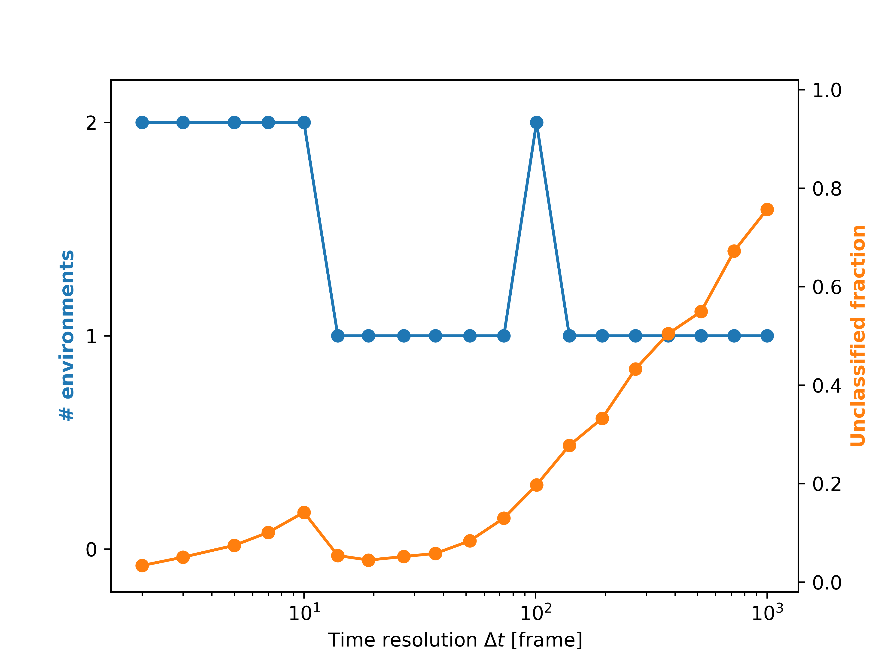
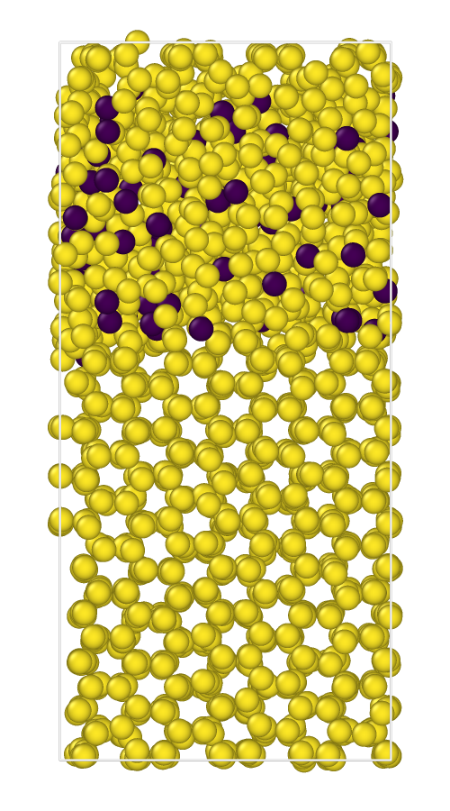
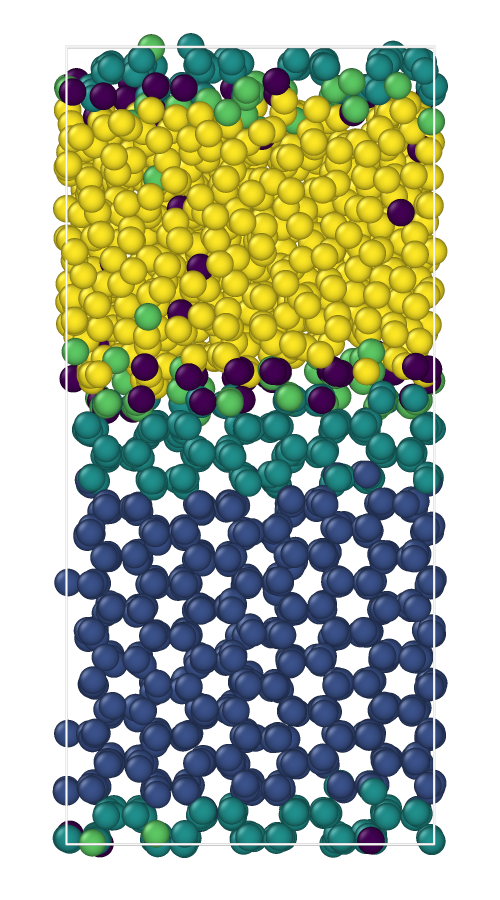

Spatial Denoising
=================

Welcome to the spatial denoising tutorial. 

In this tutorial, we will show you the effect of noise reduction by using
the spatial denoising algorithm implemented in ``dynsight`` (Related paper: `Donkor et al. <https://doi.org/10.1021/acs.jpclett.4c00383>`__, `Martino et al. <https://doi.org/10.1088/2632-2153/adfa66>`__).
We will also explain a new application of the Onion Clustering algorithm to explore different time resolutions for the classification (:class:`.trajectory.Insight.get_onion_analysis()`). 

At the end of this tutorial, you will find links to download the full ``python`` scripts 
and its relevant input files.

1. Computing TimeSOAP
---------------------

As explained in the `getting started tutorial <./getting_started.html>`_, the first step is to load a trajectory into a :class:`.trajectory.Trj` object:

.. code-block:: python

    from pathlib import Path
    from dynsight.trajectory import Trj

    files_path = Path("Path/to/the/folder/where/files/are/stored")
    trj = Trj.init_from_xtc(
        traj_file=files_path / "ice_water_ox.xtc",
        topo_file=files_path / "ice_water_ox.gro",
    )

In this tutorial, we will use the descriptor ``TimeSOAP`` ( `Caruso et al. <https://doi.org/10.1063/5.0147025>`__). 

Before understanding what ``TimeSOAP`` is, we need to define the Smooth Overlap of Atomic Positions (``SOAP``) spectra (`Bartók et al. <https://doi.org/10.1103/PhysRevB.87.184115>`__).
The ``SOAP`` descriptor, is a structural descriptor that provides a high-dimensional representation of the local structure 
around a particle by encoding the relative spatial arrangement of neighboring particles into
a smooth and continuous representation.
In this sense, the SOAP power spectrum serves as a descriptor of the degree of local order or disorder in the relative displacements of 
the weights around a center (symmetry, distances, etc.). ``TimeSOAP`` is a time-dependent descriptor that, starting from the structural description of local environments provided by ``SOAP``,
detects and tracks high-dimensional fluctuations over time in the ``SOAP`` spectra. 
It captures local structural changes or transitions in the neighborhood of every unit.

To compute ``TimeSOAP``, we first need to compute the ``SOAP`` spectra. In ``dynsight``, we can use the :class:`.trajectory.Trj.get_soap()` method:

.. code-block:: python

    # Computing SOAP descriptor
    soap = trj.get_soap(
        r_cut=10, 
        n_max=8,
        l_max=8,
        n_jobs=4, # Adjust n_jobs according to your computer capabilities
    )

the ``soap`` variable is a :class:`.trajectory.Insight` object that contains the computed ``SOAP`` spectra. 
We can now use this dataset to obtain the ``TimeSOAP`` descriptor with the :class:`.trajectory.Insight.get_timesoap()` method:

.. code-block:: python

    # Computing TimeSOAP descriptor
    _, tsoap = trj.get_timesoap(
        soap_insight=soap,
    )

Alternatively, we can compute the ``SOAP`` and ``TimeSOAP`` descriptors in a single step by using the :class:`.trajectory.Trj.get_timesoap()` method directly:

.. code-block:: python

    soap, tsoap = trj.get_timesoap(r_cut=10, n_max=8, l_max=8, n_jobs=4)

The ``tsoap`` and ``soap`` variables are the same :class:`.trajectory.Insight` objects computed above.

2. Onion Clustering analysis
----------------------------
As seen in the `getting started tutorial <./getting_started.html>`_, once we have computed the ``TimeSOAP`` descriptor, 
we can perform the clustering analysis using the Onion Clustering method. 

Given a ``delta_t`` window (in frames), Onion assigns each particle to the cluster (identified through a Kernel Density Estimation of the entire dataset) where it spends all the time.
Particles that cannot be assigned to a cluster are labeled as "unclassified fraction".

Through the :class:`.trajectory.Insight.get_onion_analysis()` method, we can perform the Onion Clustering recursively for different time windows (``delta_t``).

.. code-block:: python

    # Performing Onion Clustering on the descriptor computed
    tsoap.get_onion_analysis(
        delta_t_min=2,
        delta_t_num=20,
        fig1_path=files_path / "onion_analysis.png",
    )

This will perform the Onion Clustering analysis for 20 time windows from 2 frames to the entire simulation length.

The plot shows how the number of clusters (blue line) and the unclassified fraction (orange line) change as a function of the time window.

3. Spatial Denoising
--------------------

Nonetheless, the presence of noise in the trajectory can affect the quality of the clustering results.
To reduce the effect of noise, we can apply several denoising algorithms. Here, we will use the spatial denoising algorithm proposed by `Donkor et al. <https://doi.org/10.1021/acs.jpclett.4c00383>`__.
This algorithm works by averaging the descriptor values of neighboring particles within a cutoff radius ``r_cut``.
As seen in the `getting started tutorial <./getting_started.html>`_ for LENS, also TimeSOAP is computed for every pair of frames. Thus, the resulting dataset has shape
``(n_particles, n_frames - 1)``. Consequently, we need to remove the last frame from the trajectory:

.. code-block:: python

    # Applying Spatial Denoising
    sliced_trj = trj.with_slice(slice(0, -1, 1))
    sp_denoised_tsoap = tsoap.spatial_average(
        trj=sliced_trj,
        r_cut=10,
        n_jobs=4, # Adjust n_jobs according to your computer capabilities
    )

We can now repeat the Onion Clustering analysis on the denoised descriptor:

.. code-block:: python

    # Performing Onion Clustering on the descriptor computed
    sp_denoised_tsoap.get_onion_analysis(
        delta_t_min=2,
        delta_t_num=20,
        fig1_path=files_path / "denoised_onion_analysis.png",
    )

.. image:: ../_static/tutorials/spatial_denoising/denoised_onion_analysis.png
   :scale: 13%
   :align: center

Comparing the two plots, we can see that the denoised descriptor leads to a higher number of 
clusters detected thanks to reduction of noise-related fluctuations in the data.

4. Visualization
----------------

Now we can select a specific time window and visualize the clustering results for both the raw and denoised descriptors. Here, we considered as the best 
time window the one that corresponds to the highest number of clusters and longest ``delta_t`` (in this case, ``delta_t=37`` frames). 
This choice should guarantee that the clusters identified are stable for longer time.

.. code-block:: python

    single_point_onion = tsoap.get_onion_smooth(
        delta_t=37,
    )
    single_point_onion.dump_colored_trj(sliced_trj, files_path / "onion_trj.xyz")

    denoised_single_point_onion = sp_denoised_tsoap.get_onion_smooth(
        delta_t=37,
    )
    denoised_single_point_onion.dump_colored_trj(sliced_trj, files_path / "onion_trj_denoised.xyz")

The resulting colored snapshots for the two descriptors (raw on the left, denoised on the right) are shown below:

.. raw:: html

   

Full scripts and input files
----------------------------

.. raw:: html

    <a class="btn-download" href="../_static/simulations/ice_water_ox.gro" download>⬇️ Download the .gro file</a>  
    <a class="btn-download" href="../_static/simulations/ice_water_ox.xtc" download>⬇️ Download the .xtc file</a>  
    <a class="btn-download" href="../_static/recipes/spatial_denoising.py" download>⬇️ Download Python Script</a>