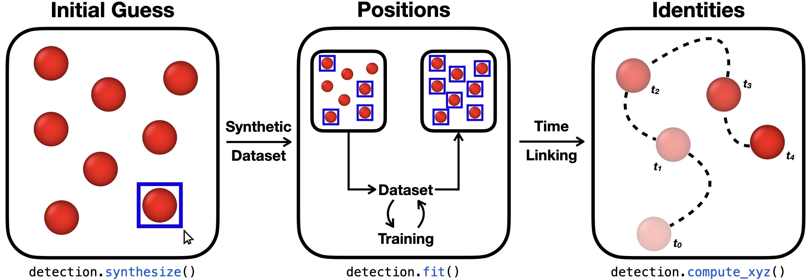

Vision
======

Code that contains useful tools to obtain trajectories from video files.
The extraction is possible thanks to the optimization of a Convolutional Neural
Network (CNN) model training to
detect specific objects in the video. Once the positions are recovered, a
tracking algorithm links each object with its own identity number.

   Schematic representation of a typical `dynsight.vision` application.

The object detection is managed by the Ultralytics_ external library. If you
use this tool, please cite them by referring to this link_.

.. _Ultralytics: https://www.ultralytics.com
.. _link: https://docs.ultralytics.com/models/yolo11/#citations-and-acknowledgements

-----
Usage
-----

.. toctree::
  :maxdepth: 1

  Video <_autosummary/dynsight.vision.Video.rst>
  Detect <_autosummary/dynsight.vision.Detect.rst>
